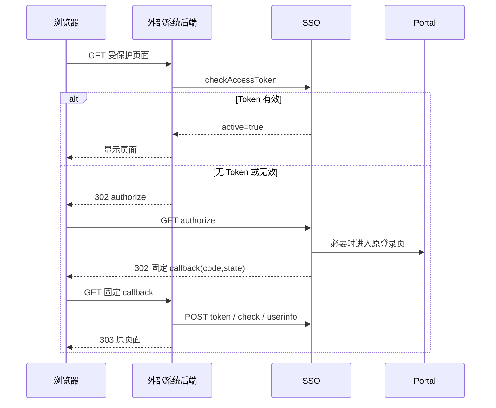

# 外部系统详细接入指南

## 1. 适用范围

本指南面向需要接入 SSO V2 的普通 Web 系统。示例使用 JDK 8 / Spring Boot 2.7，但结构同样适用于 .NET、Go、PHP、Node.js 或其它后端：

```text
页面请求
  -> 外部系统公共页面守卫
  -> SSO Token 实时校验
  -> 固定回调集中兑换
  -> 外部系统显示页面
```

前端可以是 Vue、React、服务端模板或普通 HTML。关键不在前端框架，而在于真实页面 URL 不能绕过外部系统后端守卫。



## 2. 为什么示例单独放仓库

SSO 服务端和外部系统生命周期不同：

- 服务端仓库 `DCS4/yth` 维护协议、Portal、权限和 Token 实现；
- 本仓库可以独立下载、配置和启动；
- 外部厂商不需要取得服务端源码，也不会把示例模块误打进 SSO 发布包；
- 后续可为 .NET、Go 等技术栈建立并列示例，而不污染 JeecgBoot Maven 工程。

## 3. 管理端准备

### 3.1 创建客户端

在 `yth` 管理端调用 `/common/sysSso/add` 或使用对应管理页面，填写：

```json
{
  "sysName": "B系统",
  "sysAddress": "http://192.9.230.80:18080",
  "callbackAddress": "/api/auth/callback",
  "authMode": "PAGE_CONTROLLED",
  "status": 1,
  "sysDesc": "SSO V2 B系统示例"
}
```

后端生成并只返回一次：

```json
{
  "clientId": "client_xxx",
  "clientSecret": "one-time-plaintext-secret",
  "secretVersion": 1
}
```

立即将明文 Secret 放入 B 的密钥管理系统或后端环境变量。不能写入前端仓库、SQL、截图或聊天记录。遗失后不能查询原值，只能轮换。

### 3.2 登记页面

页面受控模式为每个真实页面调用 `/common/sysSsoPage/add`：

```json
{
  "clientId": "client_xxx",
  "pageCode": "B_PAGE_01",
  "pageName": "订单查询",
  "pagePath": "/pages/orders",
  "permissionCode": "b:orders:view",
  "status": 1,
  "sortNo": 10
}
```

本示例还使用：

```text
B_PAGE_02 -> /pages/reports    -> b:reports:view
B_PAGE_03 -> /pages/operations -> b:operations:view
```

System 中相应用户必须拥有 permissionCode。页面受控模式下缺失权限编码会被拒绝登记或拒绝访问。

## 4. 外部系统改造的六个组件

### 4.1 后端配置

对应 `SsoConfig.java`：

- SSO 公共协议前缀；
- client_id；
- client_secret；
- 唯一固定 callback URL；
- 与服务端一致的 auth mode；
- 后端 HTTP 超时。

Secret 配置只对后端进程可见。容器部署时使用 Secret 挂载或受控环境变量，避免出现在镜像层和流水线日志。

### 4.2 页面白名单

对应 `PageCatalog.java`：

```text
真实后端页面路径 <-> page_code
```

可以放在数据库或配置中心，但必须满足：

1. 页面路径和 page_code 都由服务端决定；
2. 回调后的目标来自这份映射；
3. 不把浏览器提交的完整 URL 当作 target；
4. 页面路径与 SSO 管理端登记完全一致。

### 4.3 页面守卫

对应 `PageController.java` 和 `PageAccessService.enter()`。

每次真实页面请求：

1. 根据路径找到 page_code；
2. 从服务端会话取该页面 Token；
3. 调用 SSO `checkAccessToken`，先核对 `success=true`，再核对 `result.active=true`；
4. active=true 才执行页面 Controller；
5. active=false 时尝试一次 RefreshToken；
6. 刷新成功后保存新 Token 并再次校验；
7. 无 Token 或刷新失败时生成 state，并 302 到 authorize；
8. SSO 不可用时返回 503，受控页面不得放行。

在真实 Spring 项目中，可以将同样逻辑放入 HandlerInterceptor 或 Filter。不要拦截静态资源、固定回调和错误页面，否则容易形成重定向循环。

### 4.4 state 仓库

对应 `LoginStateStore.java`。

推荐结构：

```text
localSessionId + state -> pageCode, targetPath, expiresAt
```

要求：

- 至少 32 字节密码学随机数；
- 5～10 分钟过期；
- 回调时先删除再处理；
- 支持同一浏览器多个页签；
- 限制每个会话未完成事务数量；
- targetPath 必须来自服务端页面白名单。

### 4.5 固定回调

对应 `DemoController.callback()` 和 `PageAccessService.completeCallback()`。

固定回调只做后端工作：

1. 接收 `code/state` 或 `error/state`；
2. 消费 state 并恢复 pageCode/target；
3. 后端 POST `/token`，不能由 Vue 兑换；
4. 核对响应 client_id、openid 和 page_code；
5. 立即调用 checkAccessToken；
6. 获取用户白名单信息；
7. 更换本地 Session ID；
8. Token 保存到服务端；
9. 303 到服务端白名单目标页面。

回调地址不会显示业务内容，也不需要每个页面复制一套 Controller。

### 4.6 Token 仓库

对应 `PageTokenStore.java`。

页面受控模式：

```text
localSessionId + pageCode -> AccessToken + RefreshToken + expiresAt
```

普通 SSO 模式：

```text
localSessionId -> 一组系统级 Token
```

示例使用单机 HttpSession。生产多实例至少选择一种：

- Redis/Spring Session，共享加密存储；
- 负载均衡粘性会话并接受节点故障后重新授权；
- 自有 Session 服务。

RefreshToken 轮换必须对同一键加锁。不能让两个并发请求同时使用旧 RefreshToken，也不能在网络超时后盲目并发重试。

## 5. Vue 和普通页面如何接入

### 5.1 普通服务端页面

直接给真实页面 Controller 加公共拦截器。用户点击 `/pages/orders` 后，浏览器自动跟随 302/303，无需 JavaScript。

### 5.2 Vue 单页路由

仅在前端路由守卫里隐藏菜单不够，因为用户仍可输入 URL。推荐两种方式：

1. Vue 菜单先顶层导航到后端页面入口，例如 `window.location.assign('/sso-entry/B_PAGE_01')`，回调完成后再进入 Vue 路由；
2. Vue 路由加载前调用 B 后端 `/api/page-access/B_PAGE_01`，后端返回需要导航的 authorize URL；前端只执行页面导航，不接触 Token。

无论选择哪种方式，对应业务 API 仍应由 B 后端检查本地授权，不能只保护前端路由。

### 5.3 JeecgBoot 外部路由

Portal/JeecgBoot 菜单中登记外部系统页面 URL 时，URL 应指向外部系统的受保护页面或统一 entry，而不是绕开守卫的静态文件地址。菜单权限决定“是否展示入口”，外部系统后端守卫决定“直接访问是否允许”。

## 6. 两种模式的代码差异

| 行为 | PAGE_CONTROLLED | SSO_ONLY |
| --- | --- | --- |
| authorize 的 page_code | 必填 | 省略 |
| Token 保存 | 每 page_code 一组 | 本地会话共用一组 |
| check 的 pageCode | 必填 | 不传 |
| SSO 判断页面权限 | 是 | 否 |
| 外部系统业务权限 | 可继续叠加 | 必须实现 |

本示例通过 `SSO_AUTH_MODE` 切换，但服务端登记模式也必须同步修改。不要让同一个 client_id 同时运行两种模式。

## 7. 登出边界

### 7.1 退出一个页面授权

B 后端调用 SSO `/logout` 撤销该 AccessToken 对应的 Token family，然后删除本地页面 Token。

### 7.2 退出 B 系统

示例逐个调用 `/logout` 撤销 B 保存的页面 Token，再销毁 B 的 HttpSession。即使 SSO 暂不可用，本地 Session 仍会销毁。

### 7.3 Portal 全局退出

Portal 撤销全局 SID 并清 SSO Cookie。第一版不主动回调 B；B 在下一次页面 check 时收到 inactive 并清理/重新授权。外部 `/logout` 不能冒充 Portal 全局退出。

## 8. 完全不能改造的系统

完全无改造项目不能只靠 Portal 菜单实现页面权限。用户可能直接输入原地址。

只能在系统前增加认证网关，并同时保证：

- 原系统只允许网关访问；
- 用户没有其它网络路径直连；
- 网关处理 Cookie、API、静态资源、重定向和 WebSocket；
- 网关实现本指南的固定回调、Token 仓库和页面校验；
- 可信身份头只能由网关注入，原系统必须丢弃客户端伪造的同名头。

不满足网络隔离时只能称为“菜单入口受控”，不能称为“页面访问受控”。

## 9. 联调顺序

1. 确认浏览器可以访问 Portal、SSO、B 系统地址。
2. 确认 B 后端可以访问 SSO 公共地址。
3. 创建客户端并保存一次性 Secret。
4. 精确登记系统地址和 `/api/auth/callback`。
5. 登记三个页面和 permissionCode。
6. 为测试用户分配 PAGE_01 权限，不分配 PAGE_02。
7. 访问 PAGE_01，验证登录、固定回调、页面显示。
8. 再次访问 PAGE_01，确认不重新签发但仍执行校验。
9. 访问 PAGE_02，确认 access_denied。
10. 取消 PAGE_01 权限，下一次访问应立即拒绝。
11. 恢复权限后重新授权，等待 AccessToken 过期并验证刷新轮换。
12. Portal 全局退出，再访问 B 页面，确认旧 Token inactive。
13. 轮换 client_secret，确认旧密钥立即失效并安全更新 B 配置。

## 10. 上线前检查

- 原始页面 URL 不能绕过后端守卫；
- callback 完整 URL 与登记值逐字符一致；
- Secret/Token 不进入浏览器和日志；
- state 一次性、限时并绑定目标；
- 受控链路错误时 fail closed；
- RefreshToken 刷新串行且原子替换；
- 多实例 Token 和 state 使用共享存储；
- 本地 Session Cookie 启用 HttpOnly、SameSite，并在 HTTPS 下启用 Secure；
- 记录不含凭证的审计字段：requestId、clientId、pageCode、结果、时间；
- 准备 SSO 不可用、权限服务不可用和密钥轮换的运维预案。
